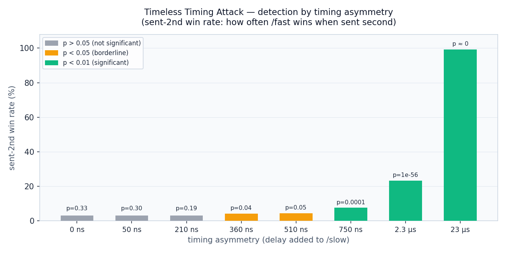

# TimelessAttack

This project is a Go proof-of-concept of the HTTP/2 concurrency-based timing attack from:

> **"Timeless Timing Attacks: Exploiting Concurrency to Leak Secrets over Remote Connections"**
> Tom Van Goethem, Christina Pöpper, Wouter Joosen, Mathy Vanhoef, USENIX Security 2020

> **Responsible use.** The server is an intentionally vulnerable demo that runs locally. Do not point the client at third-party servers. The technique shown here detects secret-dependent processing-time differences on arbitrary HTTP/2 servers, and using it against systems without authorization is unlawful.

## The Paper

Classical remote timing attacks send requests sequentially and measure response times. Over the Internet, network jitter (1-30 ms standard deviation) makes this impractical for timing differences smaller than ~10 µs.

The paper introduces **concurrency-based timing attacks**: instead of measuring absolute response times, the attacker sends two requests coalesced into a **single TCP packet** and observes the **order** in which responses come back. Because both requests travel the same network path inside the same packet, jitter hits them identically and cancels out. What remains is purely server-side processing time, giving accuracy comparable to running the measurement locally on the server itself. The paper reports **100x better precision** than classical Internet attacks, with differences as small as **100 ns** detectable over a remote connection.

The technique was demonstrated against HTTP/2 web servers, Tor onion services, and EAP-pwd Wi-Fi authentication, including a dictionary attack with 86% success rate against a server-side target previously considered immune.

## This Implementation

This implementation focuses on the **HTTP/2 direct attack** scenario. The server and client are split across two files (`server.go`, `client.go`) and built into a single binary. The client coalesces two HTTP/2 HEADERS frames into a single TCP write so both requests arrive at the server simultaneously, then records which response stream arrives first across thousands of trials. A one-sided binomial test determines whether the response order is biased enough to conclude a timing difference exists.

## Build

```bash
go build -o timeless.exe .
```

Requires Go 1.26.2+ and `golang.org/x/net` (resolved automatically via `go.mod`).

## Usage

Three modes: `server`, `client`, and `calibrate`.

### Server

```
timeless.exe -mode=server [flags]
```

| Flag | Default | Description |
|------|---------|-------------|
| `-addr` | `127.0.0.1:8443` | Listen address |
| `-slow-us` | `0` | Microseconds of CPU burn on `/slow` (time-based, scheduler-sensitive) |
| `-slow-iter` | `0` | Fixed CPU iterations on `/slow` (overrides `-slow-us`, scheduler-free) |

The server exposes two endpoints:
- `/fast`: returns immediately
- `/slow`: burns CPU for the configured duration, then returns

### Client

```
timeless.exe -mode=client [flags]
```

| Flag | Default | Description |
|------|---------|-------------|
| `-addr` | `127.0.0.1:8443` | Server address |
| `-trials` | `1000` | Number of paired trials |
| `-warmup` | `50` | Warmup trials discarded before counting |
| `-interleave` | `true` | Alternate which path gets the lower stream ID (cancels ordering bias) |
| `-timeout` | `10s` | Per-read timeout |
| `-progress` | `0` | Print a progress line every N trials (0 = silent) |
| `-v` | `false` | Verbose per-trial output |

### Calibrate

```
timeless.exe -mode=calibrate
```

Prints a table mapping `-slow-iter` values to nanoseconds on the current hardware. Use this to pick an iteration count that matches a target delay. Prefer `-slow-iter` over `-slow-us` as it makes no `time.Now()` calls and is unaffected by OS timer granularity.

### Automated Sweeps

`run-experiment.ps1` builds the binary, starts a fresh server per data point, runs the client, parses output, and writes results to `results/results.csv`. Raw client stdout is saved under `results/raw/`.

```powershell
# Iteration-mode sweep (recommended)
.\run-experiment.ps1 -SlowIterValues @(0,1000,3000,10000,30000) -Trials 5000

# Microsecond-mode sweep
.\run-experiment.ps1 -SlowUsValues @(0,1,2,5,10,20,50,100) -Trials 5000
```

CSV columns: `mode, slow_value, trials, fast_wins, fast_win_pct, fast_first_pos_pct, fast_second_pos_pct, p_value, wilson_lo, wilson_hi, duration_sec`

## Statistical Methods

**Binomial test.** Each trial is a binary outcome: did `/fast` respond first? Under the null hypothesis (no timing difference), this is a fair coin flip with p=0.5. The one-sided p-value P(X >= k) under X ~ Binomial(n, 0.5) is computed in log-space to avoid underflow at large n (`oneSidedBinomialPValue` in `client.go`).

**Wilson score interval.** A 95% confidence interval on the true win probability, preferred over the normal approximation because it stays accurate near p=0 and p=1 (`wilsonCI` in `client.go`).

**Position-conditional rates.** The client tracks win rates separately for trials where `/fast` held the lower stream ID (sent first in the TCP segment) and where it held the higher ID (sent second). A large gap between these two rates means ordering bias is contaminating the signal. `-interleave` is designed to cancel this at the aggregate level.

## Trial Run

Recorded on Windows 11, i5-14600k, loopback, with 5000 trials per data point.

### Step 1: Calibration

```
timeless.exe -mode=calibrate
```

```
timer resolution on this machine: ~677600ns
iters      ns_per_call    p10_ns         p90_ns         batch_size
10         2              1              3              1000000
30         12             11             13             1000000
100        50             49             50             1000000
300        209            209            211            1000000
1000       743            741            753            1000000
3000       2280           2161           2406           5016
10000      7637           7383           7831           5029
30000      22868          22487          23319          2340
100000     76329          75270          77403          690
```

Iteration counts selected for the sweep and their approximate delays on this hardware:

| `-slow-iter` | approx. delay |
|-------------|--------------|
| 0 | 0 (null baseline) |
| 100 | 50 ns |
| 300 | 210 ns |
| 500 | 360 ns |
| 700 | 510 ns |
| 1000 | 750 ns |
| 3000 | 2.3 µs |
| 30000 | 23 µs |

### Step 2: Sweep

```powershell
.\run-experiment.ps1 -SlowIterValues @(0,100,300,500,700,1000,3000,30000) -Trials 5000
```

| iters | delay | overall win% | sent-1st win% | sent-2nd win% | p-value |
|-------|-------|-------------|--------------|--------------|---------|
| 0 | 0 ns | 50.32% | 97.68% | 2.96% | 0.331 |
| 100 | 50 ns | 50.38% | 97.68% | 3.08% | 0.300 |
| 300 | 210 ns | 50.62% | 98.24% | 3.00% | 0.194 |
| 500 | 360 ns | 51.26% | 98.36% | 4.16% | 0.039 |
| 700 | 510 ns | 51.20% | 97.96% | 4.44% | 0.046 |
| 1000 | 750 ns | 52.70% | 97.88% | 7.52% | 7.09e-05 |
| 3000 | 2.3 µs | 61.14% | 99.12% | 23.16% | 1.41e-56 |
| 30000 | 23 µs | 99.64% | 99.96% | 99.32% | ~0 |



### What the numbers show

**The ordering bias.** The sent-1st column is 97-99% across every row including the null. When two HEADERS frames arrive in the same TLS record, the server decrypts them sequentially, so the first request gets a constant head start roughly equal to one TLS decryption. The `-interleave` flag cancels this by swapping which path gets the lower stream ID on alternating trials, which is why the overall rate sits at ~50% at 0 iters despite the 97%/3% positional split.

**Where the signal starts.** The sent-2nd column is the clean indicator: it measures how often `/fast` wins despite being sent second, which requires overcoming the TLS head start on processing time alone. At 0-300 iters it sits at 2.96-3.08%, consistent with noise. At 500-700 iters it lifts to 4.16-4.44% with p values just crossing 0.05, which is borderline. The unambiguous threshold on this hardware at 5000 trials is around 750 ns, where sent-2nd jumps to 7.52% and p drops to 7e-05.

**Comparison to the paper.** The paper reports that 100 ns requires ~39,000 pairs for 95% accuracy over an Internet connection. At 5000 trials we correctly fail to detect 50-210 ns. The paper puts 500 ns detection at ~1,600 pairs over the Internet and fewer on loopback, consistent with our 360-510 ns results sitting right at the borderline with 5000 trials. At 2.3 µs the attack is essentially certain.

## Project Structure

```
TimelessAttack/
├── server.go                    server mode, calibrate mode, TLS cert generation, flags, main
├── client.go                    client mode, H2 dial, statistical analysis
├── run-experiment.ps1           PowerShell sweep harness
├── go.mod                       module definition (Go 1.26.2)
├── go.sum                       dependency checksums
├── timeless.exe                 produced by build
└── results/
    ├── results.csv              aggregated sweep output
    ├── raw/                     per-data-point client stdout and server logs
    └── detection_chart.png      chart generated from the sample sweep
```

## Dependencies

| Module | Version | Purpose |
|--------|---------|---------|
| `golang.org/x/net` | v0.53.0 | HTTP/2 framing and HPACK |
| `golang.org/x/text` | v0.36.0 | Transitive dependency |

## Design Choices

### Why Go

The authors of the paper released a Python reference implementation at https://github.com/DistriNet/timeless-timing-attacks. We chose not to use it because the goal was to reproduce the attack from scratch and understand every layer. Go was a natural fit because `golang.org/x/net/http2` exposes a raw `Framer` API that lets you write individual HEADERS frames and decide exactly when they get flushed to the kernel. Most HTTP/2 libraries in other languages hide this behind a higher-level client abstraction, making it difficult or impossible to guarantee that two requests go out in the same syscall. Go also made it straightforward to ship both sides as a single binary without any runtime dependencies.

### One binary for both sides

The server and client are the same program, selected by `-mode`. The main practical reason is that it eliminates version skew. It also makes the experiment easy to hand to someone else: one file and one command.

### Raw framer instead of `http.Client`

Go's standard HTTP client manages its own connection pool and write scheduling internally. Using `http2.Framer` directly means we control exactly when bytes reach the kernel, which is the whole point. We needed the two HEADERS frames to arrive as a single write, not whenever the client's internal scheduler decided to flush.

### `burnIter` over `burnCPU` for the server-side delay

`burnCPU` uses `time.Now()` in a tight loop to check whether the target duration has elapsed. On Windows, `time.Now()` has ~100µs–1ms granularity and its own call overhead, which makes sub-microsecond targets meaningless and adds noise. `burnIter` does a fixed number of mixing loop iterations with no timer calls at all, so the delay is determined by CPU speed rather than OS timer resolution. The loop uses a chain of multiply-and-add steps (borrowed from the PCG random-number family) where each step depends on the previous result, so the compiler cannot skip or remove them. The final value is stored in a `sink` variable to ensure the compiler treats the whole computation as used and does not delete it.

### One connection for all trials

A fresh TLS handshake per trial would add milliseconds of latency and complicate bookkeeping since stream IDs reset on each connection. Reusing one connection keeps trials fast and ensures all measurements are made under identical conditions.

### Alternating stream order

The server processes streams in the order it receives them, so whichever request appears first in the TCP segment gets a small head start regardless of processing time. Rather than trying to eliminate this bias (which would require controlling server internals), we cancel it statistically by flipping which endpoint gets the lower stream ID on alternating trials. The bias appears symmetrically across both halves and drops out of the aggregate win rate.

## Limitations and Notes

- The self-signed TLS certificate is generated in memory at server startup. The client skips verification (`InsecureSkipVerify`). Do not use outside a controlled lab environment.
- `-slow-us` calls `time.Now()` in a tight loop and is sensitive to OS scheduler preemption. On Windows timer granularity is typically in the hundreds of microseconds range. Use `-slow-iter` for anything below ~5 µs.
- Results are most reliable on loopback (127.0.0.1) where coalescing into a single TCP segment is guaranteed. On a real LAN the attack still works but requires verifying that both frames land in one packet.
- The client reuses a single connection for all trials. On very large runs (50k+) the connection can drop mid-run due to server-side GC or scheduler delays, causing a fatal timeout. Split large runs into smaller batches if needed.
